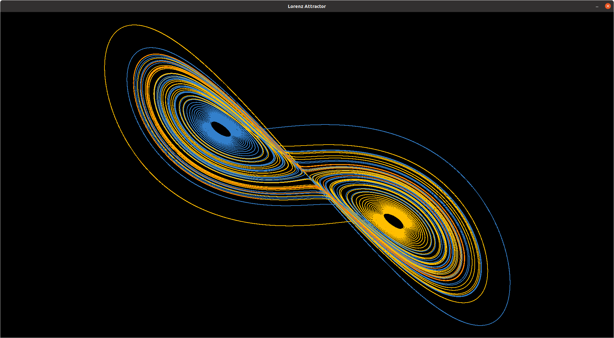
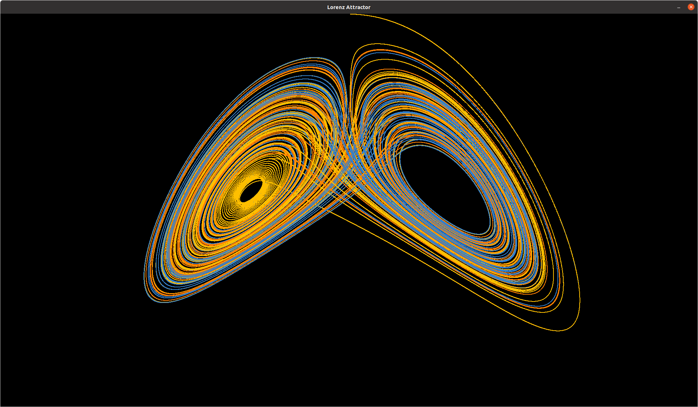

# Lorenz Attractor  
### This reprensents the Lorenz attractor The in python3 Programming Language.

    The Lorenz system is a system of ordinary differential equations first studied by Edward Lorenz. It is notable for having chaotic solutions for certain parameter values and initial conditions. In particular, the Lorenz attractor is a set of chaotic solutions of the Lorenz system. In popular media the "butterfly effect" stems from the real-world implications of the Lorenz attractor, i.e. that in any physical system, in the absence of perfect knowledge of the initial conditions (even the minuscule disturbance of the air due to a butterfly flapping its wings), our ability to predict its future course will always fail. This underscores that physical systems can be completely deterministic and yet still be inherently unpredictable even in the absence of quantum effects. The shape of the Lorenz attractor itself, when plotted graphically, may also be seen to resemble a butterfly. 

## Formular of the attractor 
~~~
    dx / dt = a(y - x)     (1)
    dy / dt = x(b - z) - y (2)
    dz / dt = xy - by      (3)
~~~
## Technologies used 

    In this project i use the following techonologies:

* Pygame: For drawing the attractor on the screen.
* Numpy : Using the ODE Solver method to speed up the algorithem, this version oft he is going to be pushed verysoon. 

## Images 

    The following imagies are the output of the program

The image for the coordinates x and y

The image for the coordinates x and z

## Short Youtube Video

[View the simulation of the attractor here](#)

[Learn more about the Lorenz Systhems and Equations.](https://en.wikipedia.org/wiki/Lorenz_system)